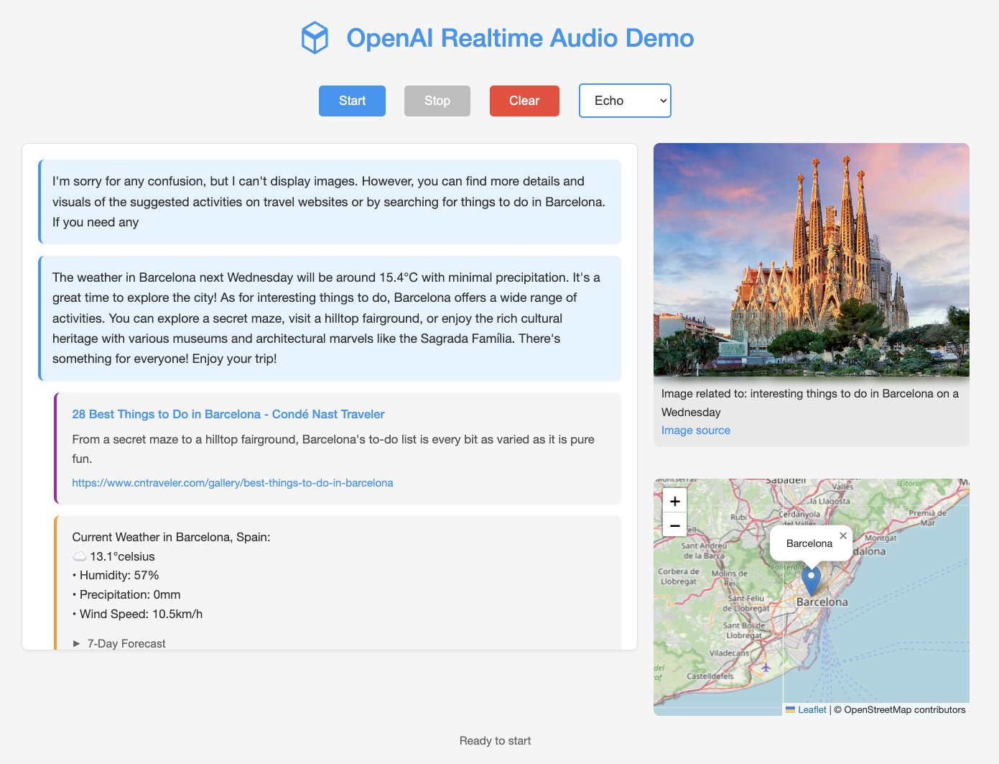

# OpenAI Real-time WebRTC Demo

A real-time audio chat application using OpenAI's realtime audio API with WebRTC. Ask about the weather in any location and get real-time responses using Open-Meteo API.

**Notes:** 

- work in progress
- works with OpenAI and Azure OpenAI; by default Azure OpenAI is used
- WebRTC API is in preview

Check .env.example for an example .env file.

## Features

- Real-time audio streaming
- Live transcription
- Weather function integration with Open-Meteo API
- Google search integration (requires SERPER_API_KEY)
- WebRTC communication
- FastAPI backend to get a ephemeral session token and to get weather data

## Setup

1. Clone the repository
2. Create a virtual environment: `python -m venv .venv`
3. Activate it: 
   - Windows: `.venv\Scripts\activate`
   - Unix/macOS: `source .venv/bin/activate`
4. Install dependencies: `pip install -r requirements.txt`
5. Create `.env` file based on `.env.example`

Notes: 

- Go to https://serper.dev/ and get your API key.
- Go to https://openai.com and get your API key.
- Modify app.py to use the OpenAI API instead of the Azure OpenAI key
- Modify config.js to use the OpenAI realtime endpoint instead of the Azure OpenAI realtime endpoint
- Modify the model name in the /session endpoint in app.py to use the OpenAI model name instead of the Azure OpenAI model name

## Running

1. Start server: `python app.py`
2. Open index.html in a browser (Tip: use live server extension for VSCode)
3. Click Start and allow microphone access
4. Try asking: "What's the weather like in Amsterdam?"

## Files

- app.py: FastAPI backend server
- index.html: Frontend interface
- config.js: Configuration for the frontend
- app.js: Frontend logic
- requirements.txt: Python dependencies
- test.http: API endpoint tests
- .env: Environment variables (create this)